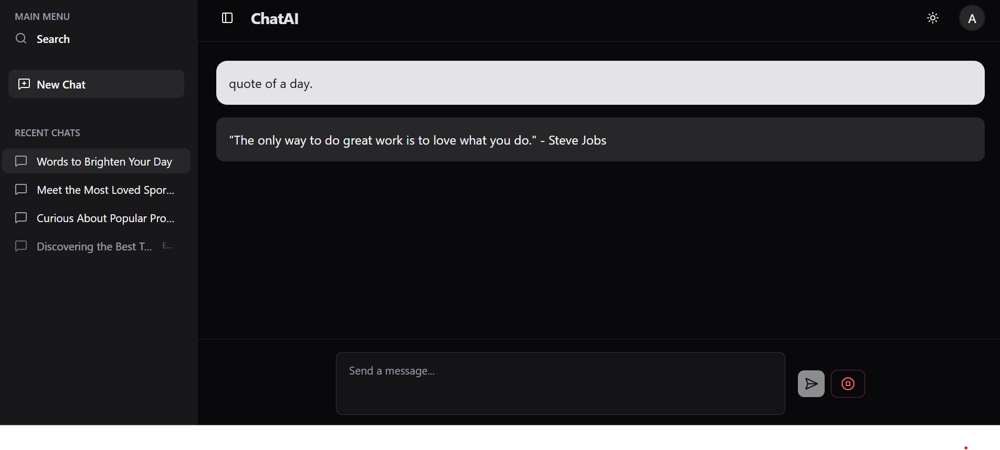
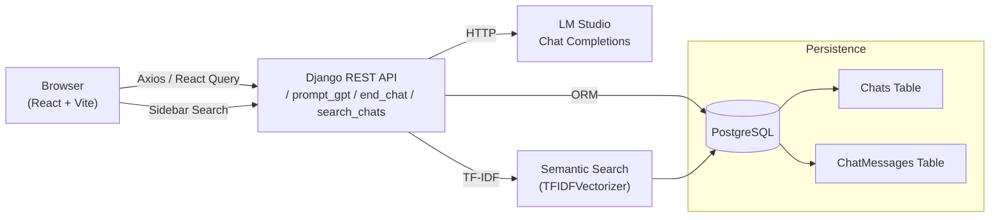

# ChatAI

Modern chat interface for interacting with a locally hosted LLM, persisting conversations, summarising sessions, and providing semantic search across past chats.

---

## 📸 Screenshots



---

## ⚙️ Setup Instructions

### Prerequisites
- **Python 3.11+** (project venv lives in `backend/chataienv`)
- **Node.js 20+** & **npm**
- **PostgreSQL 14+** (pgAdmin or psql access)
- **LM Studio** (or any OpenAI-compatible local chat completion API on `http://localhost:1234`)

### 1. Configure PostgreSQL
1. Create database and user (example values shown):
   ```sql
   CREATE DATABASE chatai_db;
   CREATE USER chataiuser WITH PASSWORD 'replace-me';
   GRANT ALL PRIVILEGES ON DATABASE chatai_db TO chataiuser;
   ```
2. Place a `.env` file in the repo root (`D:\ergosphere_assignment\.env`) with:
   ```ini
   POSTGRES_DB=chatai_db
   POSTGRES_USER=chataiuser
   POSTGRES_PASSWORD=replace-me
   POSTGRES_HOST=localhost
   POSTGRES_PORT=5432
   ```
3. Ensure the Postgres service is running.

### 2. Backend Setup
```bash
cd backend
chataienv\Scripts\activate      # on windows or source chataienv/bin/activate on macOS/Linux
python -m pip install --upgrade pip setuptools wheel
pip install -r requirements.txt
python manage.py migrate
python manage.py runserver
```

### 3. Frontend Setup
```bash
cd ../frontend
npm install
npm run dev      # launches on http://localhost:5173
```

### 4. LM Studio / Local Model
- Open LM studio and load model(it will run on port 1234 by default)
- Then in cmd ```lms server start```, so running model.

When all services are up, browse to `http://localhost:5173` for the UI.

---

##  Sample Conversation Flow & Insights

```
User:  Give me a quick recap of the Apollo 11 mission.
AI:    Apollo 11 was the 1969 NASA mission that first landed humans on the Moon...

User:  Summarise the primary objectives in bullet points.
AI:    •   Land a crewed spacecraft on the lunar surface
       •   Collect lunar materials...
       •   Return crew safely to Earth

User triggers “End Chat” → Backend asks LM Studio to generate a session summary:
Summary:
- Apollo 11’s goal was to perform the first crewed Moon landing and safe return.
- The mission emphasised EVA tasks and sample collection.
Key takeaway: Apollo 11 marked the first human footprint beyond Earth.
```

Semantic search example:
- **Query**: `"lunar landing steps"`  
- **Top match**: the conversation above with a snippet from the assistant answer plus relevance score.

---

## Architecture Overview



- **Prompt flow**: user message → backend → LM Studio → assistant reply saved to `ChatMessage` → response returned.
- **Summaries**: when a chat ends, backend rebuilds the transcript, requests a concise summary, saves it, and locks the chat state.
- **Search**: backend vectorises stored conversations on demand and ranks matches via cosine similarity.

---

## Project Structure Highlights
- `backend/chataiapp/views.py` — prompt handling, summaries, semantic search.
- `backend/chataiapp/models.py` — `Chat`, `ChatMessage`, `CustomUser` schema.
- `frontend/src/pages/HomePage.tsx` — chat interaction, end-chat workflow.
- `frontend/src/components/AppSidebar.tsx` — recent chats + search dialog.
- `doc/project-overview.md` — in-depth documentation.

---

Generated By AI. Reviewed && Edited by ME.
